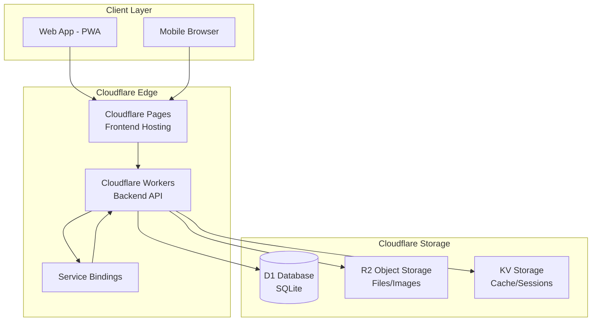

# Product Requirement Document (PRD)
## Sistem Manajemen Kehadiran Terintegrasi Loyalitas

---

## 1. Ringkasan Eksekutif

Dokumen ini menjabarkan spesifikasi aplikasi **Manajemen Kehadiran (Attendance Management)** yang terintegrasi dengan sistem loyalitas toko online. Aplikasi ini mengubah data kehadiran menjadi poin reward yang dapat ditukarkan dengan diskon di platform e-commerce.

### Visi Produk
> Membangun ekosistem terintegrasi di mana perilaku kehadiran karyawan/pengguna dikonversi menjadi mata uang digital (poin loyalitas) yang dapat ditukarkan dengan benefit di aplikasi satelit (toko online).

---

## 2. User Flow

### 2.1 Alur Pengguna (Employee/User)


### 2.2 Langkah Detail - Pengguna

| Step | Aksi | Deskripsi |
|------|------|-----------|
| 1 | **Login** | User membuka aplikasi → Input kredensial → Sistem validasi |
| 2 | **Dashboard** | Melihat status kehadiran hari ini, saldo poin, notifikasi |
| 3 | **Check-in** | Klik tombol Check-in → GPS aktif → Validasi lokasi geofence |
| 4 | **Konfirmasi** | Sistem validasi anti-spoofing (IP, mock location detector) |
| 5 | **Earning Poin** | Check-in berhasil → Poin otomatis ditambahkan ke saldo |
| 6 | **Check-out** | Saat pulang, klik Check-out → Sistem catat durasi kerja |
| 7 | **Lihat Riwayat** | Akses menu Riwayat → Lihat log kehadiran & poin |
| 8 | **Tukar Poin** | Klik menu Toko → Redirect ke toko online → Gunakan poin |

### 2.3 Alur Admin/Pemilik Toko


---

## 3. Data Structure

### 3.1 Database Schema (Cloudflare D1)

#### Tabel: `tenants` (Multi-tenant Support)
```sql
CREATE TABLE tenants (
    id TEXT PRIMARY KEY,
    name TEXT NOT NULL,
    slug TEXT UNIQUE NOT NULL,
    logo_url TEXT,
    status TEXT DEFAULT 'trial', -- 'active', 'suspended', 'trial', 'cancelled'
    plan_type TEXT DEFAULT 'free', -- 'free', 'basic', 'premium', 'enterprise'
    max_users INTEGER DEFAULT 5,
    trial_ends_at DATETIME,
    subdomain TEXT UNIQUE,
    custom_branding JSON,
    settings JSON,
    created_at DATETIME DEFAULT CURRENT_TIMESTAMP,
    updated_at DATETIME DEFAULT CURRENT_TIMESTAMP
);
```

#### Tabel: `users`
```sql
CREATE TABLE users (
    id TEXT PRIMARY KEY,
    tenant_id TEXT NOT NULL,
    email TEXT UNIQUE,
    phone TEXT,
    password_hash TEXT NOT NULL,
    name TEXT NOT NULL,
    role TEXT DEFAULT 'employee', -- 'super_admin', 'owner', 'admin', 'employee'
    points_balance INTEGER DEFAULT 0,
    status TEXT DEFAULT 'active',
    created_at DATETIME DEFAULT CURRENT_TIMESTAMP,
    updated_at DATETIME DEFAULT CURRENT_TIMESTAMP,
    FOREIGN KEY (tenant_id) REFERENCES tenants(id)
);
```

#### Tabel: `locations` (Geofence Areas)
```sql
CREATE TABLE locations (
    id TEXT PRIMARY KEY,
    tenant_id TEXT NOT NULL,
    name TEXT NOT NULL,
    latitude REAL NOT NULL,
    longitude REAL NOT NULL,
    radius_meters INTEGER DEFAULT 100,
    polygon_coords JSON, -- Untuk complex geofence
    is_active INTEGER DEFAULT 1,
    created_at DATETIME DEFAULT CURRENT_TIMESTAMP,
    FOREIGN KEY (tenant_id) REFERENCES tenants(id)
);
```

#### Tabel: `attendances`
```sql
CREATE TABLE attendances (
    id TEXT PRIMARY KEY,
    user_id TEXT NOT NULL,
    location_id TEXT NOT NULL,
    check_in_time DATETIME NOT NULL,
    check_out_time DATETIME,
    check_in_lat REAL,
    check_in_lng REAL,
    check_out_lat REAL,
    check_out_lng REAL,
    ip_address TEXT,
    device_info TEXT,
    is_valid INTEGER DEFAULT 1,
    fraud_flags JSON,
    points_earned INTEGER DEFAULT 0,
    created_at DATETIME DEFAULT CURRENT_TIMESTAMP,
    FOREIGN KEY (user_id) REFERENCES users(id),
    FOREIGN KEY (location_id) REFERENCES locations(id)
);
```

#### Tabel: `points_ledger` (Buku Besar Poin)
```sql
CREATE TABLE points_ledger (
    id TEXT PRIMARY KEY,
    user_id TEXT NOT NULL,
    transaction_type TEXT NOT NULL, -- 'earn', 'redeem', 'adjust'
    amount INTEGER NOT NULL, -- Positif = tambah, Negatif = kurang
    reference_type TEXT, -- 'attendance', 'purchase', 'bonus'
    reference_id TEXT,
    description TEXT,
    balance_after INTEGER NOT NULL,
    created_at DATETIME DEFAULT CURRENT_TIMESTAMP,
    FOREIGN KEY (user_id) REFERENCES users(id)
);
```

#### Tabel: `discount_rules` (Aturan Diskon per Tenant)
```sql
CREATE TABLE discount_rules (
    id TEXT PRIMARY KEY,
    tenant_id TEXT NOT NULL,
    name TEXT NOT NULL,
    rule_type TEXT NOT NULL, -- 'percentage', 'fixed', 'tiered'
    points_required INTEGER NOT NULL,
    discount_value REAL NOT NULL,
    max_discount REAL,
    min_purchase REAL,
    valid_from DATETIME,
    valid_until DATETIME,
    is_active INTEGER DEFAULT 1,
    created_at DATETIME DEFAULT CURRENT_TIMESTAMP,
    FOREIGN KEY (tenant_id) REFERENCES tenants(id)
);
```

#### Tabel: `point_rules` (Aturan Earning Poin)
```sql
CREATE TABLE point_rules (
    id TEXT PRIMARY KEY,
    tenant_id TEXT NOT NULL,
    name TEXT NOT NULL,
    rule_type TEXT NOT NULL, -- 'check_in', 'on_time', 'full_day', 'streak'
    points_amount INTEGER NOT NULL,
    conditions JSON, -- Kondisi tambahan
    is_active INTEGER DEFAULT 1,
    created_at DATETIME DEFAULT CURRENT_TIMESTAMP,
    FOREIGN KEY (tenant_id) REFERENCES tenants(id)
);
```

### 3.2 Billing & Subscriptions (SaaS)

#### Tabel: `subscription_plans`
```sql
CREATE TABLE subscription_plans (
    id TEXT PRIMARY KEY,
    name TEXT NOT NULL,
    slug TEXT UNIQUE NOT NULL,
    price INTEGER NOT NULL,
    currency TEXT DEFAULT 'IDR',
    interval TEXT DEFAULT 'month', -- 'month', 'year'
    features JSON,
    is_active INTEGER DEFAULT 1,
    created_at DATETIME DEFAULT CURRENT_TIMESTAMP
);
```

#### Tabel: `subscriptions`
```sql
CREATE TABLE subscriptions (
    id TEXT PRIMARY KEY,
    tenant_id TEXT NOT NULL,
    plan_id TEXT NOT NULL,
    status TEXT NOT NULL, -- 'active', 'past_due', 'canceled', 'incomplete'
    current_period_start DATETIME,
    current_period_end DATETIME,
    cancel_at_period_end INTEGER DEFAULT 0,
    created_at DATETIME DEFAULT CURRENT_TIMESTAMP,
    updated_at DATETIME DEFAULT CURRENT_TIMESTAMP,
    FOREIGN KEY (tenant_id) REFERENCES tenants(id),
    FOREIGN KEY (plan_id) REFERENCES subscription_plans(id)
);
```

#### Tabel: `invoices`
```sql
CREATE TABLE invoices (
    id TEXT PRIMARY KEY,
    tenant_id TEXT NOT NULL,
    subscription_id TEXT,
    amount_due INTEGER NOT NULL,
    amount_paid INTEGER DEFAULT 0,
    status TEXT NOT NULL, -- 'paid', 'open', 'void', 'uncollectible'
    invoice_url TEXT,
    pdf_url TEXT,
    due_date DATETIME,
    paid_at DATETIME,
    created_at DATETIME DEFAULT CURRENT_TIMESTAMP,
    FOREIGN KEY (tenant_id) REFERENCES tenants(id)
);
```

#### Tabel: `custom_domains`
```sql
CREATE TABLE custom_domains (
    id TEXT PRIMARY KEY,
    tenant_id TEXT NOT NULL,
    domain TEXT UNIQUE NOT NULL,
    status TEXT DEFAULT 'pending', -- 'pending', 'active', 'failed'
    verification_details JSON,
    created_at DATETIME DEFAULT CURRENT_TIMESTAMP,
    FOREIGN KEY (tenant_id) REFERENCES tenants(id)
);
```

#### Tabel: `usage_metrics`
```sql
CREATE TABLE usage_metrics (
    id TEXT PRIMARY KEY,
    tenant_id TEXT NOT NULL,
    metric_name TEXT NOT NULL, -- 'users_count', 'storage_used', 'api_calls'
    metric_value REAL NOT NULL,
    recorded_at DATETIME DEFAULT CURRENT_TIMESTAMP,
    FOREIGN KEY (tenant_id) REFERENCES tenants(id)
);
```

### 3.3 File Storage (Cloudflare R2)

```
r2-bucket/
├── tenants/
│   └── {tenant_id}/
│       ├── logo.png
│       └── assets/
├── users/
│   └── {user_id}/
│       └── avatar.jpg
├── reports/
│   └── {tenant_id}/
│       └── attendance_2026_01.csv
└── evidence/
    └── {attendance_id}/
        └── selfie.jpg  (Jika fitur foto aktif)
```

---

## 4. Tech Stack

### 4.1 Arsitektur Cloudflare



### 4.2 Stack Detail

| Layer | Teknologi | Kegunaan |
|-------|-----------|----------|
| **Frontend** | React/Vue + Vite | SPA dengan PWA support |
| **Styling** | Tailwind CSS | Rapid UI development |
| **Hosting** | Cloudflare Pages | Static hosting + edge functions |
| **Backend** | Cloudflare Workers | Serverless API (Hono/Itty-router) |
| **Database** | Cloudflare D1 | SQLite di edge |
| **File Storage** | Cloudflare R2 | S3-compatible object storage |
| **Cache** | Cloudflare KV | Session & data caching |
| **Auth** | JWT + Argon2 | Secure authentication |
| **Maps** | Leaflet.js | Geofencing UI |

### 4.3 Struktur Project

```
absen/
├── frontend/                 # Cloudflare Pages
│   ├── src/
│   │   ├── components/
│   │   ├── pages/
│   │   ├── hooks/
│   │   ├── lib/
│   │   └── App.tsx
│   ├── public/
│   ├── package.json
│   └── vite.config.ts
│
├── worker/                   # Cloudflare Workers
│   ├── src/
│   │   ├── index.ts          # Entry point
│   │   ├── routes/
│   │   │   ├── auth.ts
│   │   │   ├── attendance.ts
│   │   │   ├── points.ts
│   │   │   └── admin.ts
│   │   ├── middleware/
│   │   │   ├── auth.ts
│   │   │   └── validation.ts
│   │   ├── services/
│   │   │   ├── geofence.ts
│   │   │   ├── fraud-detection.ts
│   │   │   └── points-engine.ts
│   │   └── utils/
│   ├── wrangler.toml
│   └── package.json
│
├── schema/
│   └── migrations/
│       └── 0001_initial.sql
│
├── docs/
│   └── PRD.md
│
├── .github/
│   └── workflows/
│       └── deploy.yml
│
└── README.md
```

### 4.4 Konfigurasi Wrangler (wrangler.toml)

```toml
name = "absen-api"
main = "src/index.ts"
compatibility_date = "2024-01-01"

[[d1_databases]]
binding = "DB"
database_name = "absen-db"
database_id = "<database-id>"

[[r2_buckets]]
binding = "STORAGE"
bucket_name = "absen-files"

[[kv_namespaces]]
binding = "CACHE"
id = "<kv-namespace-id>"

[vars]
ENVIRONMENT = "production"
```

---

## 5. Deployment & GitHub Integration

### 5.1 Setup Repository

```bash
# 1. Initialize git repository
cd c:\Aplikasi\absen
git init
git add .
git commit -m "Initial commit: PRD and project structure"

# 2. Add remote origin
git remote add origin https://github.com/add146/absen.git

# 3. Push ke GitHub
git branch -M main
git push -u origin main
```

### 5.2 Cloudflare Pages Connection

1. **Login ke Cloudflare Dashboard** → Pages
2. **Create a Project** → Connect to Git
3. **Select Repository**: `add146/absen`
4. **Build Settings**:
   - Framework preset: `Vite`
   - Build command: `npm run build`
   - Build output directory: `dist`
   - Root directory: `frontend`
5. **Environment Variables**:
   ```
   VITE_API_URL = https://absen-api.<account>.workers.dev
   ```

### 5.3 GitHub Actions Workflow

```yaml
# .github/workflows/deploy.yml
name: Deploy to Cloudflare

on:
  push:
    branches: [main]

jobs:
  deploy-worker:
    runs-on: ubuntu-latest
    steps:
      - uses: actions/checkout@v4
      - uses: actions/setup-node@v4
        with:
          node-version: '20'
      
      - name: Install Dependencies
        run: |
          cd worker
          npm ci
      
      - name: Deploy Worker
        uses: cloudflare/wrangler-action@v3
        with:
          apiToken: ${{ secrets.CLOUDFLARE_API_TOKEN }}
          workingDirectory: worker
          command: deploy

  deploy-pages:
    runs-on: ubuntu-latest
    needs: deploy-worker
    steps:
      - uses: actions/checkout@v4
      - uses: actions/setup-node@v4
        with:
          node-version: '20'
      
      - name: Install & Build Frontend
        run: |
          cd frontend
          npm ci
          npm run build
      
      - name: Deploy to Cloudflare Pages
        uses: cloudflare/pages-action@v1
        with:
          apiToken: ${{ secrets.CLOUDFLARE_API_TOKEN }}
          accountId: ${{ secrets.CLOUDFLARE_ACCOUNT_ID }}
          projectName: absen
          directory: frontend/dist
```

---

## 6. UI/UX Recommendations

### 6.1 Design System

#### Color Palette
```css
:root {
  /* Primary - Professional Blue */
  --primary-50: #eff6ff;
  --primary-500: #3b82f6;
  --primary-600: #2563eb;
  --primary-700: #1d4ed8;
  
  /* Success - Check-in Green */
  --success-500: #22c55e;
  
  /* Warning - Late Orange */
  --warning-500: #f59e0b;
  
  /* Error - Absent Red */  
  --error-500: #ef4444;
  
  /* Neutral */
  --gray-50: #f9fafb;
  --gray-900: #111827;
}
```

#### Typography
- **Font Family**: Inter atau Outfit (Google Fonts)
- **Heading**: Bold, tracking tight
- **Body**: Regular, line-height 1.6

### 6.2 Mobile-First Design

```
┌─────────────────────────────────┐
│  ⏱️ 08:45:23                    │  ← Status Bar
├─────────────────────────────────┤
│                                 │
│     👤 Selamat Pagi, John!     │
│                                 │
│  ┌─────────────────────────────┐   │
│  │                         │   │
│  │    🟢 CHECK-IN NOW      │   │  ← Big CTA Button
│  │                         │   │
│  └─────────────────────────────┘   │
│                                 │
│  📍 Kantor Pusat - Dalam Area  │  ← Location Status
│                                 │
├─────────────────────────────────┤
│  ⭐ Saldo Poin: 1,250          │
│  📊 Kehadiran Bulan Ini: 95%   │
├─────────────────────────────────┤
│                                 │
│  Riwayat Terakhir              │
│  ├ Hari ini    ✅ 08:02       │
│  ├ Kemarin     ✅ 07:58       │
│  └ 2 hari lalu ⚠️ 08:35       │
│                                 │
├─────────────────────────────────┤
│  🏠    📊    🏪    👤          │  ← Bottom Nav
└─────────────────────────────────┘
```

### 6.3 Key UI Components

| Component | Description | Design Notes |
|-----------|-------------|--------------|
| **Check-in Button** | Tombol utama | Besar, prominent, dengan animasi pulse |
| **Location Indicator** | Status GPS | Real-time, dengan ikon dan warna status |
| **Points Card** | Saldo poin | Glassmorphism effect, gradient background |
| **Attendance Calendar** | Kalender | Heat map style, warna per status |
| **History List** | Riwayat | Cards dengan timeline connector |
| **Admin Dashboard** | Panel admin | Data tables + charts (Chart.js) |

### 6.4 Micro-Interactions

- **Check-in Success**: Confetti animation + haptic feedback
- **Points Earned**: Counter animation dari 0 ke nilai final
- **Button Hover**: Scale transform + shadow elevation
- **Loading States**: Skeleton screens, bukan spinner
- **Pull to Refresh**: Custom illustration + smooth transition

### 6.5 Accessibility (A11y)

- Contrast ratio minimal 4.5:1
- Focus indicators jelas
- Touch targets minimal 44x44px
- Screen reader labels pada semua interactive elements
- Support dark mode

### 6.6 Progressive Web App (PWA)

- **Offline Support**: Service worker untuk caching
- **Push Notifications**: Reminder check-in/out
- **Add to Home Screen**: App-like experience
- **Background Sync**: Queue check-in saat offline

---

## 7. Security Considerations

### 7.1 Anti-Fraud Measures

1. **GPS Spoofing Detection**
   - Cek mock location flag dari device
   - Validasi IP geolocation vs GPS coords
   - Analisis kecepatan movement (impossible travel)

2. **Request Authentication**
   - Nonce untuk setiap request
   - Short-lived tokens (15 menit)
   - Device fingerprinting

3. **Data Integrity**
   - Immutable audit log
   - Cryptographic signatures pada records
   - Rate limiting per user

### 7.2 Authentication Flow


---

## 8. Verification Plan

### 8.1 Automated Tests

```bash
# Unit tests
npm run test

# Integration tests  
npm run test:integration

# E2E tests dengan Playwright
npm run test:e2e
```

### 8.2 Manual Verification

- [ ] Test geofencing dengan lokasi real
- [ ] Test mock location detection
- [ ] Test multi-tenant isolation
- [ ] Test points earning & redemption flow
- [ ] Performance testing (latency < 100ms)
- [ ] Security penetration testing

---

## 9. Timeline Estimasi

| Phase | Duration | Deliverables |
|-------|----------|--------------|
| Setup | 1 minggu | Repo, CI/CD, Cloudflare resources |
| Backend Core | 2 minggu | Auth, Attendance, Points API |
| Frontend MVP | 2 minggu | Check-in flow, Dashboard |
| Admin Panel | 1 minggu | User & location management |
| Integration | 1 minggu | Shop integration, testing |
| Polish | 1 minggu | Bug fixes, performance tuning |

**Total: ~8 minggu**

---

> - Disaster recovery plan

---

## 7. Update Implementasi (03 Februari 2026)

### 7.1 Super Admin System (Completed)
Sistem **Super Admin** telah diimplementasikan sepenuhnya dengan fitur:
- management **Tenant** (CRUD + Suspend)
- management **Global Settings** (API Keys, WAHA Session, Midtrans)
- management **User** lintas tenant (Cleanup & Bulk Delete)
- **Platform Analytics** (Real-time charts)
- **Profile Management** dengan keamanan password BCrypt.

### 7.2 Dashboard Refinement
- **Admin Dashboard**: Dikembalikan ke tampilan klasik dengan akses untuk `admin` dan `owner`.
- **Tenant Dashboard Route**: `/tenant/dashboard` otomatis redirect ke `/admin/dashboard`.

### 7.3 Perbaikan Global Settings
- UI Disederhanakan: Menghapus technical keys (underscore), hanya menampilkan label deskriptif.
- **WAHA Integration**: Penambahan kolom `waha_session_name` untuk multi-device support.

### 7.4 Update Implementasi (04 Februari 2026)

#### Advanced Geofencing
- **Polygon Mode**: Admin dapat menggambar area poligonal kompleks untuk validasi lokasi yang lebih akurat (ray-casting algorithm).
- **Radius Visualization**:
  - Marker Pin kini dapat didrag & drop untuk menentukan titik tengah.
  - Lingkaran biru (Radius Circle) visual mempresentasikan area cakupan sesuai dengan setting meter.
  - Lingkaran tetap terlihat pada lokasi yang tersimpan untuk kemudahan monitoring.
- **GPS Accuracy Note**: Penambahan disclaimer "GPS accuracy varies 5-20m" di bawah peta.

#### User Experience Improvements
- **Attendance Heatmap Calendar**: Visualisasi kehadiran bulanan dengan indikator warna (Hadir, Terlambat, Absen).
- **Mobile Optimization**:
  - Penambahan indikator versi aplikasi (v1.0.1).
  - Tombol **"Update App"** untuk force clear cache tanpa reload manual.
  - Perbaikan font pada status lokasi (Medium Weight, Size LG) agar lebih bersih.
  - Penghapusan teks "Ready to Check-in" yang redundan.

#### Camera Features
- **Switch Camera**: Dukungan tombol flip kamera untuk berganti antara kamera depan dan belakang.
- **Face Verification**: Integrasi foto selfie wajib saat check-in.

### 7.5 Project Hardening & PWA (04 Februari 2026)
Fase penguatan sistem (hardening) dan implementasi fitur Progressive Web App telah selesai dilakukan.

#### Infrastructure & DevOps
- **Automated Testing**: Implementasi unit testing menggunakan `Vitest` untuk Backend (Workers) dan Frontend (React).
- **CI/CD Pipelines**: Otomatisasi testing dan deployment menggunakan GitHub Actions.
    - `test.yml`: Running test suite pada setiap Pull Request/Push.
    - `deploy.yml`: Auto-deploy ke Cloudflare Workers & Pages saat merge ke main.

#### Advanced Security
- **Rate Limiting**: Proteksi endpoint API menggunakan IP-based rate limiting (20 req/min untuk auth) dan Tenant-based limits.
- **Security Headers**: Implementasi header keamanan global (HSTS, XSS Protection, No-Sniff) pada level Worker middleware.

#### Monitoring & Observability
- **Health Check Endpoint**: `/health` endpoint untuk memantau status koneksi database dan latency.
- **Structured Logging**: Utility logging terstandarisasi untuk debugging yang lebih efektif.

#### Progressive Web App (PWA)
- **Offline Capability**: Penambahan `offline.html` sebagai fallback page yang branded saat tidak ada koneksi internet.
- **Smart Caching**: Service Worker dikonfigurasi untuk caching asset statis dan halaman offline.
- **Installable**: Memenuhi kriteria installable (Manifest lengkap, hi-res icons) untuk Android, iOS, dan Desktop.

#### User Experience
- **Real-time Dashboard**: Super Admin Dashboard kini melakukan polling data otomatis setiap 30 detik untuk visualisasi metrics yang up-to-date.
- **Accessibility (A11y)**: Perbaikan label ARIA pada komponen interaktif (tombol tema, ikon statistik) untuk mendukung screen readers.

### 7.6 Update Implementasi (04 Februari 2026 - Part 2)

#### Point Rules Engine (Loyalty System)
- **Dynamic Rules Engine**: Implementasi mesin aturan poin yang fleksibel, menggantikan sistem hardcoded.
- **Rule Types**:
  - `check_in`: Poin dasar kehadiran.
  - `on_time`: Bonus poin untuk ketepatan waktu (sebelum jam 09:00).
  - `full_day`: Bonus poin untuk durasi kerja penuh (> 8 jam).
  - `streak`: Bonus untuk kehadiran berturut-turut (Coming Soon).
- **Timezone Aware**: Kalkulasi waktu check-in menyesuaikan dengan format waktu lokal (Asia/Jakarta) untuk akurasi rule `on_time`.

#### Reporting & Billing
- **Export Data**: Fitur download laporan kehadiran dalam format CSV via backend streaming untuk performa dataset besar.
- **Invoice History UI**: Halaman baru bagi Admin untuk melihat riwayat tagihan berlangganan, status pembayaran, dan download invoice (PDF).

#### QA & Reliability
- **Unit Testing**: Penambahan coverage test untuk `PointsEngine` menggunakan Vitest, memastikan logika pemberian poin akurat dalam berbagai skenario (tepat waktu vs terlambat).

### 7.7 Update Implementasi (04 Februari 2026 - Part 3)

#### Full Localization (Bahasa Indonesia)
- **Admin & Super Admin Interfaces**: Seluruh antarmuka administrator telah diterjemahkan sepenuhnya ke dalam Bahasa Indonesia untuk kemudahan penggunaan lokal.
  - Termasuk dashboard, manajemen karyawan, pengaturan lokasi, dan laporan.
  - Status attendance (Masuk, Keluar, Terlambat) dan pesan error juga telah terlokalisasi.

#### Feature Completion
- **Invoice History UI**: Implementasi penuh halaman riwayat tagihan (`InvoiceHistory.tsx`) yang memungkinkan admin melihat status pembayaran dan mengunduh invoice.

### 7.8 Update Implementasi (05 Februari 2026)

#### User Onboarding & Admin UX
- **Company Code Display**: Dashboard Admin kini menampilkan "Kode Perusahaan" (Tenant Slug) secara prominen di kartu paling atas. Dilengkapi tombol "Copy" untuk mempermudah admin membagikan kode ke karyawan baru.
- **Admin Branding**: Logo header pada layout admin diperbarui menjadi "Absen Admin" dengan ikon keamanan, memperjelas konteks halaman yang sedang diakses.
- **Header Fixes**: Perbaikan `z-index` pada header dashboard untuk mencegah elemen tombol "Check-in" menutupi navigasi saat di-scroll pada layar kecil.

#### Image Storage Architecture
- **Worker Proxy for R2**: Implementasi route `/upload/file/:key` pada Worker untuk melayani file gambar langsung dari R2 bucket.
  - Menggantikan kebutuhan domain publik R2 yang bermasalah.
  - Memastikan kompatibilitas akses gambar profil dan bukti foto di seluruh platform (termasuk report PDF yang akan datang).

#### Points System Logic Refinement
- **Daily Check-in Limit**: Perbaikan query database (`PointsEngine`) untuk deteksi check-in harian yang lebih akurat (menggunakan ISO string comparison), mencegah double-claim poin dalam satu hari.
- **Sidebar Integration**: Integrasi saldo poin dinamis pada menu sidebar "Hadiah", memberikan feedback instan kepada user tanpa perlu membuka menu rewards.
- **Duration Cap**: Konfirmasi dan retensi aturan batas maksimal 13 jam durasi kerja untuk klaim "Full Day Bonus", mencegah eksploitasi poin akibat lupa check-out.
- **Order Management Polish**: UI manajemen pesanan toko yang lengkap dengan filter status (Pending, Completed, Cancelled) dan fitur ekspor CSV.
- **System Health Monitoring**: Halaman pemantauan kesehatan sistem (`SystemHealth.tsx`) yang menampilkan status real-time dari API Gateway dan Database.
- **Fraud Detection UI Refinement**: Visualisasi indikator kecurangan yang lebih jelas (Mock GPS, Impossible Travel) dengan badge risiko (Rendah, Sedang, Tinggi).

---

### 7.8 Incident Report & System Adjustments (04 Februari 2026 - Critical Fixes)

#### Emergency Authentication Bypass (KV Quota Mitigation)
Akibat limitasi kuota tulis Cloudflare KV (1000 writes/day), sistem login mengalami kegagalan massal (Error 500). Sistem telah dimodifikasi dengan **Emergency Login Endpoint** yang mem-bypass caching KV sementara waktu. Middleware `tenantContext` dan `rateLimiter` (write-mode) dinonaktifkan untuk mencegah exhaust quota.

#### JWT Configuration Standardization
Login loop disebabkan oleh mismatch konfigurasi JWT. Perbaikan meliputi:
- Standardisasi JWT Secret Key (menggunakan hardcoded key sementara menggantikan env var yang hilang).
- Penegakan algoritma hashing `HS256`.
- Penyesuaian payload `sub` & `tenant_id` agar konsisten dengan middleware.

#### Rewards System Hotfix
Validasi ID produk dilonggarkan untuk mendukung legacy product ID (non-UUID), menyelesaikan error "Invalid product ID format" saat penukaran poin.

---

### 7.8 Update Implementasi (05 Februari 2026)

#### Storage Optimization & Scalability
- **KV Removal**: Migrasi penyimpanan metadata dan rate-limiting dari Workers KV ke D1 Database untuk efisiensi biaya.
- **Image Compression (R2)**: Integrasi Cloudflare Image Resizing. Foto yang diupload kini dikompresi otomatis saat diakses (Quality 60), menghemat bandwidth hingga 60-70%.
- **Storage Analytics**: Dashboard baru bagi Super Admin untuk memantau penggunaan penyimpanan tenant secara real-time (jumlah file, tipe file, total size).

#### Attendance & User Experience
- **Calendar History View**: Refactor total tampilan riwayat absensi. Menggantikan tabel statis dengan **Kalender Interaktif**:
  - **Visual Indicators**: Warna status (Hadir, Terlambat, Cuti).
  - **Daily Timeline**: Detail aktivitas harian (Clock In/Out, Lokasi) yang muncul saat tanggal diklik.
  - **Lightbox Modal**: Klik thumbnail foto untuk melihat versi resolusi tinggi.
  - Tampilan ini digunakan konsisten baik di halaman User maupun Admin.
- **Camera Verification Toggle**: Setting baru bagi Tenant Admin untuk mengaktifkan/menonaktifkan kewajiban foto selfie saat check-in.
- **UI Polish**: Penambahan background color pada tombol aksi (History, Edit, Delete) di manajemen karyawan untuk visual yang lebih jelas.
- **Bug Fix**: Koreksi kalkulasi statistik "Terlambat" agar hanya menghitung satu kali per hari unik.

## 8. Gap & Future Roadmap (Updated)

Meskipun fitur utama telah selesai (85% Completion), beberapa fitur berikut masih dalam status **Pending** atau **Partial**:

1.  **Custom Domain Strategy**: Menggunakan fitur native **Cloudflare for SaaS (Custom Hostnames)**. Pengaturan dilakukan via Cloudflare Dashboard atau simplifikasi UI di masa depan, mengurangi kebutuhan build UI kompleks di awal.
2.  **Advanced Testing**: Unit test ada, namun End-to-End (E2E) testing dengan Playwright belum disetup.
3.  **Disaster Recovery**: Rencana pemulihan bencana formal belum didokumentasikan sepenuhnya.
4.  **Background Sync**: Fitur offline sync telah diimplementasikan (IndexedDB + Service Worker + Auto Retry).

*Catatan: Fitur Email Notifications telah dihapus dari roadmap sesuai keputusan bisnis 04 Feb 2026. Fokus notifikasi sepenuhnya pada WhatsApp (WAHA).*
