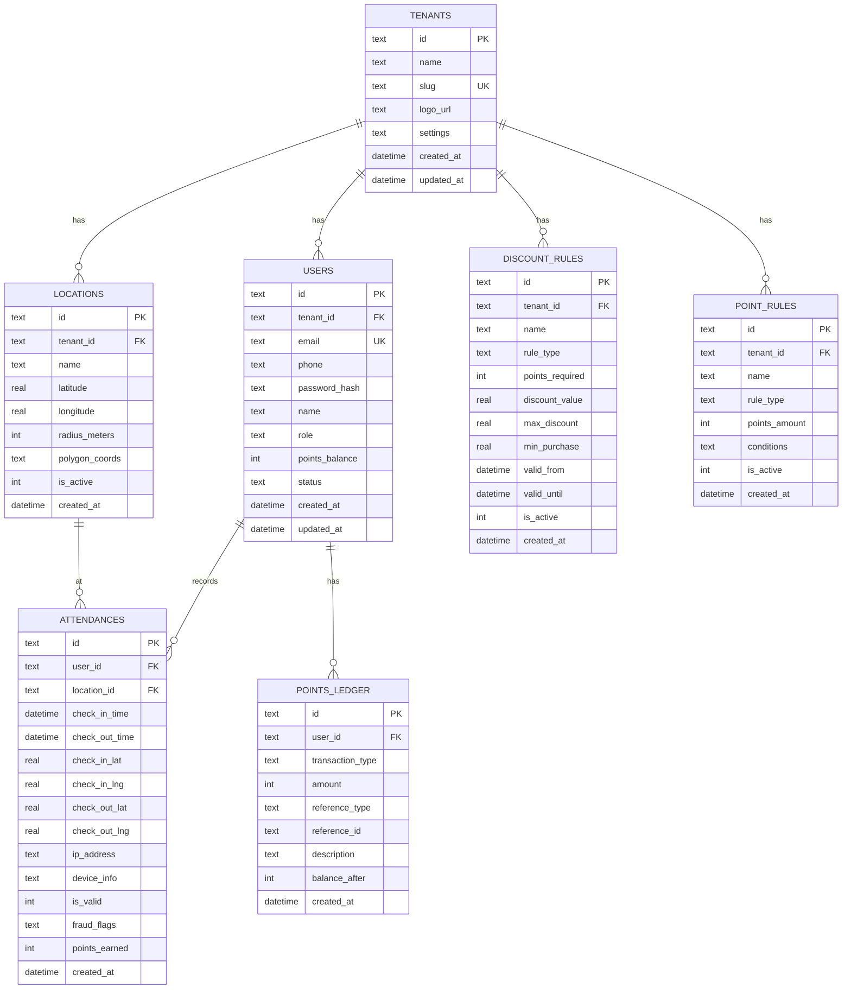

# 🗄️ Database Schema

## Overview

Database menggunakan **Cloudflare D1** (SQLite di edge). Semua tabel mendukung arsitektur **multi-tenant**.

## Entity Relationship Diagram



## Tabel Detail

### 1. tenants
Menyimpan data perusahaan/organisasi (multi-tenant).

| Column | Type | Constraints | Description |
|--------|------|-------------|-------------|
| id | TEXT | PRIMARY KEY | UUID tenant |
| name | TEXT | NOT NULL | Nama perusahaan |
| slug | TEXT | UNIQUE, NOT NULL | URL-friendly identifier |
| logo_url | TEXT | - | URL logo di R2 |
| settings | TEXT | - | JSON konfigurasi |
| created_at | DATETIME | DEFAULT NOW | Waktu dibuat |
| updated_at | DATETIME | DEFAULT NOW | Waktu update |

**Settings JSON Structure:**
```json
{
  "timezone": "Asia/Jakarta",
  "work_start": "08:00",
  "work_end": "17:00",
  "late_tolerance_minutes": 15,
  "require_photo": false
}
```

---

### 2. users
Menyimpan data pengguna sistem.

| Column | Type | Constraints | Description |
|--------|------|-------------|-------------|
| id | TEXT | PRIMARY KEY | UUID user |
| tenant_id | TEXT | FK → tenants | Tenant pemilik |
| email | TEXT | UNIQUE | Email login |
| phone | TEXT | - | Nomor HP |
| password_hash | TEXT | NOT NULL | Argon2 hash |
| name | TEXT | NOT NULL | Nama lengkap |
| role | TEXT | DEFAULT 'employee' | Role user |
| points_balance | INTEGER | DEFAULT 0 | Saldo poin saat ini |
| status | TEXT | DEFAULT 'active' | Status akun |
| created_at | DATETIME | DEFAULT NOW | Waktu dibuat |
| updated_at | DATETIME | DEFAULT NOW | Waktu update |

**Role Values:**
- `employee` - Karyawan biasa
- `admin` - Admin perusahaan
- `owner` - Pemilik/super admin tenant

**Status Values:**
- `active` - Akun aktif
- `inactive` - Akun nonaktif
- `suspended` - Akun diblokir

---

### 3. locations
Menyimpan area geofencing untuk check-in.

| Column | Type | Constraints | Description |
|--------|------|-------------|-------------|
| id | TEXT | PRIMARY KEY | UUID lokasi |
| tenant_id | TEXT | FK → tenants | Tenant pemilik |
| name | TEXT | NOT NULL | Nama lokasi |
| latitude | REAL | NOT NULL | Koordinat lintang |
| longitude | REAL | NOT NULL | Koordinat bujur |
| radius_meters | INTEGER | DEFAULT 100 | Radius geofence (meter) |
| polygon_coords | TEXT | - | JSON polygon untuk area kompleks |
| is_active | INTEGER | DEFAULT 1 | Status aktif (0/1) |
| created_at | DATETIME | DEFAULT NOW | Waktu dibuat |

**Polygon Coords JSON Format:**
```json
[
  {"lat": -6.208, "lng": 106.845},
  {"lat": -6.209, "lng": 106.846},
  {"lat": -6.210, "lng": 106.844}
]
```

---

### 4. attendances
Menyimpan record check-in/check-out.

| Column | Type | Constraints | Description |
|--------|------|-------------|-------------|
| id | TEXT | PRIMARY KEY | UUID attendance |
| user_id | TEXT | FK → users | User yang check-in |
| location_id | TEXT | FK → locations | Lokasi check-in |
| check_in_time | DATETIME | NOT NULL | Waktu check-in |
| check_out_time | DATETIME | - | Waktu check-out |
| check_in_lat | REAL | - | Latitude saat check-in |
| check_in_lng | REAL | - | Longitude saat check-in |
| check_out_lat | REAL | - | Latitude saat check-out |
| check_out_lng | REAL | - | Longitude saat check-out |
| ip_address | TEXT | - | IP address user |
| device_info | TEXT | - | User agent/device info |
| is_valid | INTEGER | DEFAULT 1 | Validitas record |
| fraud_flags | TEXT | - | JSON fraud detection flags |
| points_earned | INTEGER | DEFAULT 0 | Poin yang didapat |
| created_at | DATETIME | DEFAULT NOW | Waktu dibuat |

**Fraud Flags JSON:**
```json
{
  "mock_location": false,
  "ip_mismatch": false,
  "impossible_travel": false,
  "suspicious_device": false
}
```

---

### 5. points_ledger
Buku besar transaksi poin (immutable audit trail).

| Column | Type | Constraints | Description |
|--------|------|-------------|-------------|
| id | TEXT | PRIMARY KEY | UUID transaksi |
| user_id | TEXT | FK → users | User pemilik |
| transaction_type | TEXT | NOT NULL | Tipe: earn/redeem/adjust |
| amount | INTEGER | NOT NULL | Jumlah (+/-) |
| reference_type | TEXT | - | Sumber: attendance/purchase/bonus |
| reference_id | TEXT | - | ID referensi |
| description | TEXT | - | Deskripsi transaksi |
| balance_after | INTEGER | NOT NULL | Saldo setelah transaksi |
| created_at | DATETIME | DEFAULT NOW | Waktu transaksi |

---

### 6. discount_rules
Aturan diskon per tenant.

| Column | Type | Constraints | Description |
|--------|------|-------------|-------------|
| id | TEXT | PRIMARY KEY | UUID rule |
| tenant_id | TEXT | FK → tenants | Tenant pemilik |
| name | TEXT | NOT NULL | Nama promo |
| rule_type | TEXT | NOT NULL | percentage/fixed/tiered |
| points_required | INTEGER | NOT NULL | Poin yang dibutuhkan |
| discount_value | REAL | NOT NULL | Nilai diskon |
| max_discount | REAL | - | Maksimum diskon |
| min_purchase | REAL | - | Minimum pembelian |
| valid_from | DATETIME | - | Berlaku mulai |
| valid_until | DATETIME | - | Berlaku sampai |
| is_active | INTEGER | DEFAULT 1 | Status aktif |
| created_at | DATETIME | DEFAULT NOW | Waktu dibuat |

---

### 7. point_rules
Aturan earning poin per tenant.

| Column | Type | Constraints | Description |
|--------|------|-------------|-------------|
| id | TEXT | PRIMARY KEY | UUID rule |
| tenant_id | TEXT | FK → tenants | Tenant pemilik |
| name | TEXT | NOT NULL | Nama aturan |
| rule_type | TEXT | NOT NULL | check_in/on_time/full_day/streak |
| points_amount | INTEGER | NOT NULL | Poin yang didapat |
| conditions | TEXT | - | JSON kondisi tambahan |
| is_active | INTEGER | DEFAULT 1 | Status aktif |
| created_at | DATETIME | DEFAULT NOW | Waktu dibuat |

**Conditions JSON Examples:**
```json
// On-time bonus
{
  "before_time": "08:15",
  "bonus_multiplier": 1.5
}

// Streak bonus
{
  "consecutive_days": 5,
  "bonus_points": 50
}
```

## Indexes

```sql
CREATE INDEX idx_users_tenant ON users(tenant_id);
CREATE INDEX idx_users_email ON users(email);
CREATE INDEX idx_locations_tenant ON locations(tenant_id);
CREATE INDEX idx_attendances_user ON attendances(user_id);
CREATE INDEX idx_attendances_date ON attendances(check_in_time);
CREATE INDEX idx_points_ledger_user ON points_ledger(user_id);
CREATE INDEX idx_points_ledger_date ON points_ledger(created_at);
```

## Migration Commands

```bash
# Apply migration
wrangler d1 execute absen-db --file=./schema/migrations/0001_initial.sql

# Query data
wrangler d1 execute absen-db --command="SELECT * FROM users LIMIT 10"

# Export database
wrangler d1 export absen-db --output=backup.sql
```
