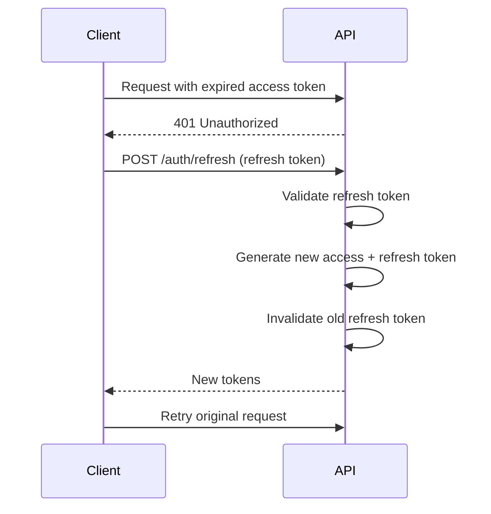

# 🔐 Security Guidelines

## Overview

Dokumen ini menjelaskan implementasi keamanan untuk Sistem Manajemen Kehadiran.

## Authentication

### JWT Token Strategy

```
┌─────────────────────────────────────────────────┐
│                  Token Types                     │
├─────────────────────────────────────────────────┤
│ Access Token                                     │
│ - Expires: 15 menit                             │
│ - Contains: user_id, tenant_id, role            │
│ - Storage: Memory (React state)                 │
├─────────────────────────────────────────────────┤
│ Refresh Token                                    │
│ - Expires: 7 hari                               │
│ - Contains: user_id, token_family               │
│ - Storage: HttpOnly cookie                      │
└─────────────────────────────────────────────────┘
```

### Token Payload Structure

```typescript
interface AccessTokenPayload {
  sub: string;        // user_id
  tid: string;        // tenant_id
  role: string;       // user role
  iat: number;        // issued at
  exp: number;        // expiration
}

interface RefreshTokenPayload {
  sub: string;        // user_id
  fam: string;        // token family (for rotation)
  iat: number;
  exp: number;
}
```

### Token Rotation



### Password Security

```typescript
// Password hashing dengan Argon2
import { hash, verify } from '@node-rs/argon2';

const hashedPassword = await hash(password, {
  memoryCost: 19456,    // 19 MB
  timeCost: 2,          // iterations
  parallelism: 1,       // threads
  outputLen: 32         // hash length
});
```

## Anti-Fraud Measures

### 1. GPS Spoofing Detection

```typescript
interface FraudCheckResult {
  is_suspicious: boolean;
  flags: {
    mock_location: boolean;
    ip_mismatch: boolean;
    impossible_travel: boolean;
    suspicious_device: boolean;
  };
  risk_score: number; // 0-100
}

async function checkAttendanceFraud(
  attendance: AttendanceRequest
): Promise<FraudCheckResult> {
  const flags = {
    // Cek flag mock location dari device
    mock_location: attendance.is_mock_location === true,
    
    // Bandingkan IP geolocation vs GPS
    ip_mismatch: await checkIpLocationMismatch(
      attendance.ip_address,
      attendance.latitude,
      attendance.longitude
    ),
    
    // Cek kecepatan perpindahan tidak wajar
    impossible_travel: await checkImpossibleTravel(
      attendance.user_id,
      attendance.latitude,
      attendance.longitude
    ),
    
    // Cek device fingerprint suspicious
    suspicious_device: await checkDeviceFingerprint(
      attendance.device_info
    )
  };
  
  const risk_score = calculateRiskScore(flags);
  
  return {
    is_suspicious: risk_score > 50,
    flags,
    risk_score
  };
}
```

### 2. Geofencing Validation

```typescript
// Haversine formula untuk jarak
function calculateDistance(
  lat1: number, lon1: number,
  lat2: number, lon2: number
): number {
  const R = 6371e3; // Earth radius in meters
  const φ1 = lat1 * Math.PI / 180;
  const φ2 = lat2 * Math.PI / 180;
  const Δφ = (lat2 - lat1) * Math.PI / 180;
  const Δλ = (lon2 - lon1) * Math.PI / 180;

  const a = Math.sin(Δφ/2) ** 2 +
            Math.cos(φ1) * Math.cos(φ2) *
            Math.sin(Δλ/2) ** 2;
  const c = 2 * Math.atan2(Math.sqrt(a), Math.sqrt(1-a));

  return R * c; // Distance in meters
}

// Ray casting untuk polygon geofence
function isPointInPolygon(
  point: {lat: number, lng: number},
  polygon: {lat: number, lng: number}[]
): boolean {
  let inside = false;
  for (let i = 0, j = polygon.length - 1; i < polygon.length; j = i++) {
    if (
      polygon[i].lng > point.lng !== polygon[j].lng > point.lng &&
      point.lat < (polygon[j].lat - polygon[i].lat) * 
        (point.lng - polygon[i].lng) / 
        (polygon[j].lng - polygon[i].lng) + polygon[i].lat
    ) {
      inside = !inside;
    }
  }
  return inside;
}
```

### 3. Request Nonce

```typescript
// Setiap request check-in harus punya nonce unik
interface CheckInRequest {
  latitude: number;
  longitude: number;
  location_id: string;
  nonce: string;       // UUID, sekali pakai
  timestamp: number;   // Unix timestamp
  signature: string;   // HMAC signature
}

function validateRequest(request: CheckInRequest): boolean {
  // 1. Cek timestamp tidak expired (5 menit)
  const now = Date.now();
  if (Math.abs(now - request.timestamp) > 5 * 60 * 1000) {
    throw new Error('Request expired');
  }
  
  // 2. Cek nonce belum pernah digunakan
  const isUsed = await cache.get(`nonce:${request.nonce}`);
  if (isUsed) {
    throw new Error('Nonce already used');
  }
  
  // 3. Simpan nonce ke cache (expire 10 menit)
  await cache.set(`nonce:${request.nonce}`, '1', { ttl: 600 });
  
  // 4. Verify signature
  const payload = `${request.latitude}:${request.longitude}:${request.timestamp}:${request.nonce}`;
  const expectedSignature = hmac('sha256', SECRET_KEY, payload);
  if (request.signature !== expectedSignature) {
    throw new Error('Invalid signature');
  }
  
  return true;
}
```

## Rate Limiting

```typescript
// Implementasi dengan Cloudflare KV
async function rateLimit(
  key: string,
  limit: number,
  window: number
): Promise<boolean> {
  const current = await env.CACHE.get(`rate:${key}`);
  const count = current ? parseInt(current) : 0;
  
  if (count >= limit) {
    return false; // Rate limited
  }
  
  await env.CACHE.put(
    `rate:${key}`,
    String(count + 1),
    { expirationTtl: window }
  );
  
  return true;
}

// Middleware
async function rateLimitMiddleware(c: Context, next: Next) {
  const ip = c.req.header('CF-Connecting-IP');
  const userId = c.get('userId');
  
  // IP-based limit: 100 req/menit
  if (!await rateLimit(`ip:${ip}`, 100, 60)) {
    return c.json({ error: 'Rate limited' }, 429);
  }
  
  // User-based limit untuk check-in: 5 req/menit
  if (c.req.path.includes('/check-in')) {
    if (!await rateLimit(`checkin:${userId}`, 5, 60)) {
      return c.json({ error: 'Too many check-in attempts' }, 429);
    }
  }
  
  await next();
}
```

## Data Protection

### 1. Encryption at Rest

- D1: SQLite dengan encryption (Cloudflare managed)
- R2: Server-side encryption (SSE)
- KV: Encrypted by default

### 2. Encryption in Transit

- HTTPS enforced (Cloudflare)
- TLS 1.3
- HSTS header

### 3. Sensitive Data Handling

```typescript
// Jangan log data sensitif
const sanitizeLog = (data: any) => {
  const sensitive = ['password', 'token', 'secret', 'phone', 'email'];
  const sanitized = { ...data };
  
  for (const key of Object.keys(sanitized)) {
    if (sensitive.some(s => key.toLowerCase().includes(s))) {
      sanitized[key] = '[REDACTED]';
    }
  }
  
  return sanitized;
};
```

### 4. PII Compliance

- Password: Never stored in plain text
- Email: Dapat di-hash untuk lookup
- Phone: Encrypted jika perlu
- GPS coordinates: Hanya disimpan saat check-in

## Input Validation

```typescript
import { z } from 'zod';

// Schema validation untuk check-in
const CheckInSchema = z.object({
  latitude: z.number()
    .min(-90).max(90)
    .refine(v => !isNaN(v), 'Invalid latitude'),
  longitude: z.number()
    .min(-180).max(180)
    .refine(v => !isNaN(v), 'Invalid longitude'),
  location_id: z.string()
    .uuid('Invalid location ID'),
  nonce: z.string()
    .uuid('Invalid nonce'),
  timestamp: z.number()
    .int()
    .positive()
});

// Middleware
function validateBody<T>(schema: z.ZodSchema<T>) {
  return async (c: Context, next: Next) => {
    try {
      const body = await c.req.json();
      const validated = schema.parse(body);
      c.set('body', validated);
      await next();
    } catch (e) {
      if (e instanceof z.ZodError) {
        return c.json({
          error: 'Validation error',
          details: e.errors
        }, 400);
      }
      throw e;
    }
  };
}
```

## CORS Configuration

```typescript
import { cors } from 'hono/cors';

app.use('*', cors({
  origin: [
    'https://absen.pages.dev',
    'https://app.yourdomain.com'
  ],
  allowMethods: ['GET', 'POST', 'PUT', 'DELETE'],
  allowHeaders: ['Content-Type', 'Authorization'],
  exposeHeaders: ['X-Request-Id'],
  maxAge: 86400,
  credentials: true
}));
```

## Security Headers

```typescript
app.use('*', async (c, next) => {
  await next();
  
  // Security headers
  c.header('X-Content-Type-Options', 'nosniff');
  c.header('X-Frame-Options', 'DENY');
  c.header('X-XSS-Protection', '1; mode=block');
  c.header('Referrer-Policy', 'strict-origin-when-cross-origin');
  c.header('Permissions-Policy', 'geolocation=(self)');
  c.header('Content-Security-Policy', 
    "default-src 'self'; " +
    "script-src 'self' 'unsafe-inline'; " +
    "style-src 'self' 'unsafe-inline' fonts.googleapis.com; " +
    "font-src 'self' fonts.gstatic.com; " +
    "img-src 'self' data: blob:; " +
    "connect-src 'self' *.workers.dev"
  );
});
```

## Audit Logging

```typescript
interface AuditLog {
  id: string;
  timestamp: string;
  user_id: string;
  tenant_id: string;
  action: string;
  resource: string;
  resource_id: string;
  ip_address: string;
  user_agent: string;
  details: object;
  outcome: 'success' | 'failure';
}

async function logAudit(
  c: Context,
  action: string,
  resource: string,
  resourceId: string,
  details: object,
  outcome: 'success' | 'failure'
) {
  const log: AuditLog = {
    id: crypto.randomUUID(),
    timestamp: new Date().toISOString(),
    user_id: c.get('userId'),
    tenant_id: c.get('tenantId'),
    action,
    resource,
    resource_id: resourceId,
    ip_address: c.req.header('CF-Connecting-IP') || '',
    user_agent: c.req.header('User-Agent') || '',
    details,
    outcome
  };
  
  // Write to D1 audit table
  await c.env.DB.prepare(`
    INSERT INTO audit_logs 
    (id, timestamp, user_id, tenant_id, action, resource, 
     resource_id, ip_address, user_agent, details, outcome)
    VALUES (?, ?, ?, ?, ?, ?, ?, ?, ?, ?, ?)
  `).bind(
    log.id, log.timestamp, log.user_id, log.tenant_id,
    log.action, log.resource, log.resource_id,
    log.ip_address, log.user_agent,
    JSON.stringify(log.details), log.outcome
  ).run();
}
```

## Incident Response

### Detection
- Monitor failed login attempts
- Alert on unusual geolocation patterns
- Track rate limit hits

### Response Checklist
1. [ ] Identify affected users
2. [ ] Revoke compromised tokens
3. [ ] Review audit logs
4. [ ] Notify stakeholders
5. [ ] Document incident
6. [ ] Implement fixes
7. [ ] Post-mortem review
